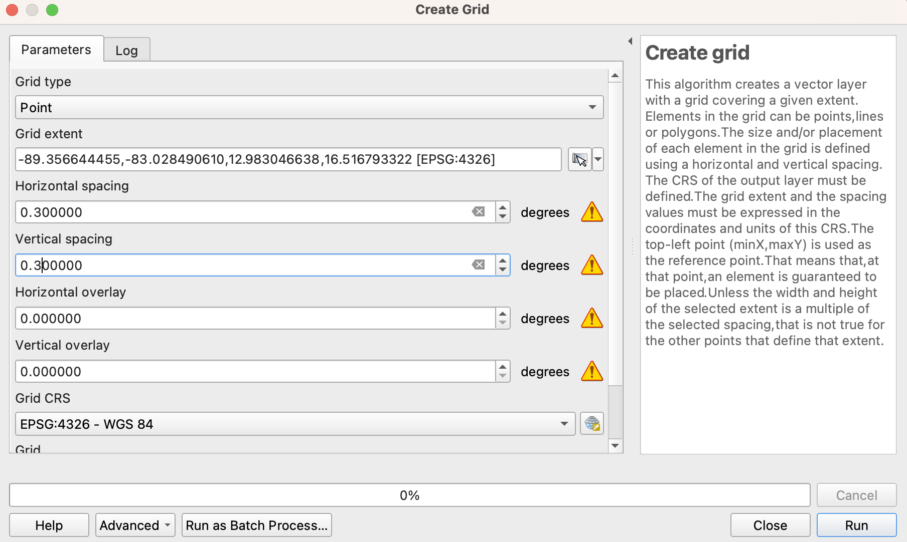
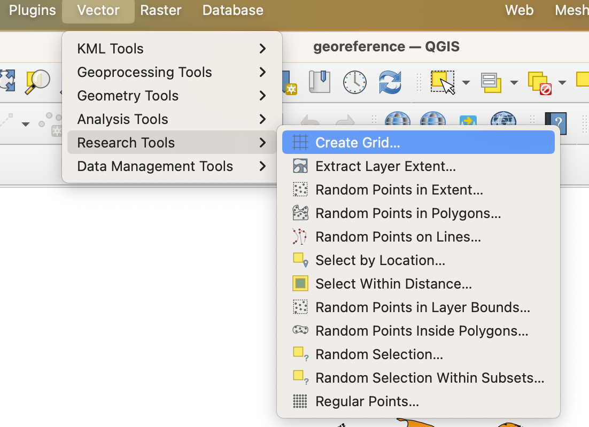

# Guidelines for Digitalization of Legacy Soil Maps {#guidelines_2}

Legacy soil maps are a valuable source of information about the distribution of soils and its properties. These maps are in the form of paper sheets that must be translated into proper digital formats. Building a digital repository for legacy maps is a detailed and methodical process that transforms valuable historical map data in paper format, into a digital format that's accessible, accurate, and useful for various applications. Each step, from preparation and digitization to database development and user interface design, plays a critical role in creating a repository that meets the needs of its users and stands the test of time.

Creating a digital repository for legacy maps involves a series of methodical steps. Below is a comprehensive guideline of to facilitate this process:

## Project Planning and Scope Definition
   *  Objective Setting: Define the purpose and scope of the digital repository, including the type of maps and associated information to be digitized, as well as the structure of the database, file naming and structure of the data storage.
   *  Allocate essential resources such as skilled personnel, advanced technology, and sufficient funding. Digitizing large maps necessitates specialized staff and appropriate digitizing equipment. While small scanners can be used, large-format scanners are preferable for efficiency in the digitization process. Given that digitization generates substantial file sizes, adequate data storage solutions must be in place to handle the considerable volume of data produced. The digitization process is labour-intensive and demands significant time investment, necessitating careful financial planning to cover the costs associated with staffing and other related expenses.
   *  Timeline Establishment: Developing a comprehensive project timeline is crucial for the successful completion of the digital repository. This involves delineating specific milestones and setting firm deadlines for each phase of the project. Start by mapping out the initial stages, such as data collection, preparation of paper maps, and the procurement of necessary equipment and resources. Assign realistic timeframes to each of these activities, considering factors like the volume of maps to be digitized, the availability of resources, and the complexity of the tasks. Following the preparation phase, outline the time required for the actual digitization process. This includes scanning, quality checks, georeferencing, and rectification of the maps. Allocate sufficient time for data extraction, vectorization, and the subsequent integration of this data into the database, ensuring that each step is afforded the attention it requires for accuracy and thoroughness.
   Next, incorporate time for the creation and standardization of metadata, a critical component that facilitates data retrieval and utilization. Factor in additional time for database development and the importing of digitized maps and metadata. Include a phase for quality assurance and data validation to ensure the integrity and accuracy of the digital repository. This phase should allow for review, error correction, and cross-verification against original sources. Finally, designate time for discussing data accessibility, and the implementation of potential training programs for developers. It’s essential to also include ongoing maintenance and regular updates in the timeline.
   
## Data Collection and Inventory
   *  Map Sourcing: Gather all paper maps that need to be digitized.
   *  Inventory Creation: Create an inventory of these maps, noting their condition, scale, date, and any other relevant details. Catalogue each map in detail, including metadata like geographical coverage, scale, date of creation, and source.

## Preparation of Paper Maps for Digitization
   *  Map Cleaning and Repair: This step is important to enhance the quality of the scans, ensuring that the digitized versions accurately reflect the original maps. The goal is to prepare the maps in a way that maximizes the clarity and readability of the digital images, thereby facilitating a more precise and effective digitization process. Ensure maps are clean and repair any damages to improve scan quality. Special attention should be paid to preserving the integrity of the maps during cleaning and repair, using appropriate archival materials and techniques to avoid further deterioration. 

## Digitization Process
   *  Scanning: Choose appropriate scanning technology based on map size, quality, and detail. Carefully scan each map to create digital copies, ensuring high resolution and clarity. Scan the maps in the way that north points to the top.

   *  Quality Control: Conduct quality checks to ensure scans are clear and accurate representations of the original maps. Legacy maps are often stored in unfavourable ambient conditions. Take into consideration that characteristics such as room moisture can alter the size of the maps and cause deformations that can be a source of uncertainty in later steps of digitalization.  

## Georeferencing and Rectification
   *  Georeferencing: Assign geographic coordinates to the digitized maps so they align with real-world locations.
   *  Rectification: Correct any distortions in the maps to ensure geographical accuracy.
   
   Steps in QGIS.
   1) Add a vector layer covering the extension of the map. It can be a shapefile with the national boundaries. Use a map with a known coordinate system - i.e. EPSG:4326
   
   2) Create a grid of reference as the coordinate grid in the paper map. Vector -> Research Tools -> Create Grid
   
```{r, fig-georreference_fig1, fig.cap = "Create Grid options", echo = FALSE}

```

```{r, fig-georreference_fig2, fig.cap = "Create Grid dialog box", echo = FALSE}

```

   3) Open the Georeferencer: Layer -> Georeferencer. The Georeferencer dialog box will appear.
   
```{r, fig-georreference_fig3, fig.cap = "Georeferencer box", echo = FALSE}
knitr::include_graphics("images/georreference_fig3.png")
```


## Data Extraction and Vectorization
   *  Extracting Information: Extract relevant information from the maps, including geographical features, legends, and notes.
   *  Vectorization: Convert map features into vector data for GIS compatibility and manipulation.

## Metadata Creation and Standardization
   *  Metadata Documentation: Create detailed metadata for each map, including information on original source, date, scale, georeferencing details, and data accuracy.
   *  Standardization: Ensure metadata is standardized across all maps for consistency.

## Database Development and Data Import
   *  Database Design: Develop a database structure that accommodates maps and associated metadata.
   *  Data Import: Import digitized maps and metadata into the database.

## Quality Assurance and Data Validation
   *  Error Checking: Perform thorough checks to identify and correct any errors or inconsistencies in the data.
   *  Validation: Validate the data against original maps and other reliable sources for accuracy.
   
## Accessibility and User Interface Design
   *  Access Permissions: Determine access levels for different users.
   *  User Interface: Develop a user-friendly interface for the digital repository, allowing easy search, access, and navigation.
   
##  Maintenance and Updating
   *  Regular Updates: Establish procedures for regularly updating the repository with new data or corrections.
   *  Maintenance Plan: Develop a maintenance plan for the digital repository, including regular backups and technical support.
   
## Legal and Ethical Considerations
   *  Copyright Compliance: Ensure digitization and sharing of map data comply with copyright laws.
   *  Ethical Standards: Adhere to ethical standards in data sharing and usage.
   
## Outreach and User Training
   *  Promotion: Promote the digital repository among potential users.
   *  Training Programs: Offer training programs for users to effectively utilize the repository.

# Automated techniques for data extraction.

Segmentation


```{r, setup}
library(reticulate)
```


```{python echo = FALSE , eval = FALSE}
import numpy as np
import matplotlib.pyplot as plt
from skimage import data, segmentation, feature, future
from sklearn.ensemble import RandomForestClassifier
from functools import partial
import matplotlib.pyplot as plt
import matplotlib.image as mpimg
from PIL import Image
```

```{python eval = FALSE}
img = mpimg.imread('/content/example_map.jpeg')
imgplot = plt.imshow(img)
plt.show()
```


```{python eval = FALSE}
# Build an array of labels for training the segmentation.
# Here we use rectangles but visualization libraries such as plotly
# (and napari?) can be used to draw a mask on the image.
training_labels = np.zeros(img.shape[:2], dtype=np.uint8)
training_labels[6:162, 616:790] = 1
training_labels[5:76, 1638:1898] = 1
training_labels[5:190, 13:500] = 1
training_labels[122:236, 911:969] = 2
training_labels[757:974, 1581:1746] = 2
training_labels[843:990, 381:534] = 2
training_labels[281:304, 39:150] = 3
training_labels[982:1004, 1347:1399] = 3
training_labels[1002:1037, 1667:1703] = 3
training_labels[358:385, 902:927] = 4
training_labels[563:568, 802:863] = 4
training_labels[347:369, 1119:1155] = 4
training_labels[293:306, 1034:1087] = 5
training_labels[422:449, 833:876] = 5
training_labels[600:622, 653:701] = 5
```

```{python eval = FALSE}
plt.imshow(img)
plt.contour(training_labels)
plt.title("Image and segmentation boundaries")
```


```{python eval = FALSE}
sigma_min = 1
sigma_max = 16
features_func = partial(feature.multiscale_basic_features,
                        intensity=True, edges=False, texture=True,
                        sigma_min=sigma_min, sigma_max=sigma_max,
                        channel_axis=-1)
features = features_func(img)
clf = RandomForestClassifier(n_estimators=50, n_jobs=-1,
                             max_depth=10, max_samples=0.05)
clf = future.fit_segmenter(training_labels, features, clf)
result = future.predict_segmenter(features, clf)
```

```{python eval = FALSE}
fig, ax = plt.subplots(1, 2, sharex=True, sharey=True, figsize=(9, 4))
ax[0].imshow(segmentation.mark_boundaries(img, result, mode='thick'))
ax[0].contour(training_labels)
ax[0].set_title('Image, mask and segmentation boundaries')
ax[1].imshow(result)
ax[1].set_title('Segmentation')
fig.tight_layout()
```

```{python eval = FALSE}
fig, ax = plt.subplots(1, 2, sharex=True, sharey=True, figsize=(9, 4))
ax[0].imshow(segmentation.mark_boundaries(img, result, mode='thick'))
ax[0].contour(training_labels)
ax[0].set_title('Image, mask and segmentation boundaries')
ax[1].imshow(result)
ax[1].set_title('Segmentation')
fig.tight_layout()
```


```{python eval = FALSE}
im = Image.fromarray(result)
im.save("/content/result.jpeg")
```

Predict new images

```{python eval = FALSE}
img_test = mpimg.imread('/content/testing_map.jpg')
features_new = features_func(img_test)
result_new = future.predict_segmenter(features_new, clf)
fig, ax = plt.subplots(1, 2, sharex=True, sharey=True, figsize=(6, 4))
ax[0].imshow(segmentation.mark_boundaries(img_test, result_new, mode='thick'))
ax[0].set_title('Image')
ax[1].imshow(result_new)
ax[1].set_title('Segmentation')
fig.tight_layout()
plt.show()
```

Save predictions to disk

```{python eval = FALSE}
im = Image.fromarray(result_new)
im.save("/content/result_test.jpeg")
```