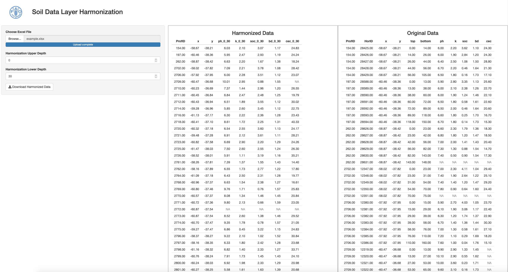

# Integration with Digital Soil Mapping {#integration_DSM}

As described previously, a proper Soil Legacy Data Repository constitutes a valuable resource of data in many fields of application. In particular, it is highly valuable in Digital Soil Mapping implementations to derive maps of soil properties from existing data [@CARRE20071]. 
The integration of such data in DSM activities requires additional data harmonisation procedures to ensure that the estimations comply with a common set of rules: the dataset has to include the same properties in relation to the same soil depth interval, which generally is not the case in databases of soil data. Soil profiles are formed by soil horizons, with properties measured at the soil horizon depth, and  harmonisation of soil profile layers, to determine the values of properties at the same soil depth, is required to derive a sound database to be used within a DSM framework.
This requirement is addressed at Global Soil Partnership within ` Pillar 4 - enhance the quantity and quality of soil data and information`: data collection, analysis, validation, reporting, monitoring and integration with other disciplines; and `Pillar 5 - harmonisation of methods, measurements and indicators for the sustainable management and protection of soil resources`. In this sense, methods for soil data layer harmonisation have been developed at GSP. The procedure is described in section 6.5 of the [Global Soil Nutrient and Nutrient Budgets maps (GSNmap) Phase I Technical manual](https://fao-gsp.github.io/GSNmap-TM/).
 (Harmonize Soil Layer Depths). This methodology makes use of splines interpolation methods to derive a harmonised database  at fixed soil depths. A friendly integration of such analyses is available within a [Shiny web application](https://geoforsk.shinyapps.io/Harmonize/) at the site https://geoforsk.shinyapps.io/Harmonize/ (Fig. \@ref(fig:fig-harmonize)). You can download an example file to use within the application at http://www.geoforsk.com/datos/fao/example.xlsx.


```{r, fig-harmonize, fig.cap = "Output of the Shiny app to harmonize soil properties to fixed soil depths", echo = FALSE}

```


